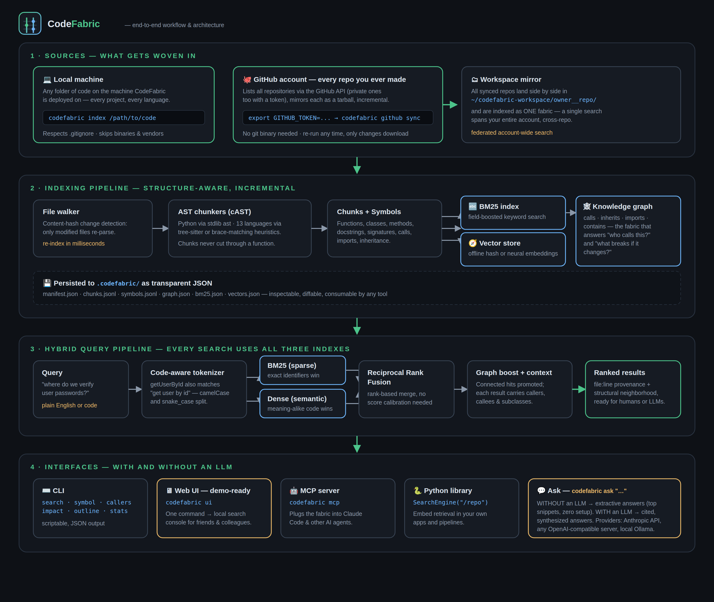

<p align="center">
  
</p>

<p align="center">
  <b>Weave every line of code you own into one searchable knowledge fabric.</b><br/>
  Hybrid code search (keyword + semantic + code graph) for your machine and your entire GitHub account —<br/>
  with or without an LLM, 100% open source, zero required dependencies.
</p>

<p align="center">
  
  
  
  
</p>

---

## What is CodeFabric?

CodeFabric turns codebases into a **knowledge fabric**: it parses your code with
real syntax awareness, builds three complementary indexes — a keyword index, a
semantic vector index, and a **code knowledge graph** (who calls what, what
inherits what, what imports what) — and answers questions across all of them
at once. Ask in plain English (*"where do we verify user passwords?"*) or by
symbol (*"who calls `load_user`?"*), from the CLI, a local web console, an AI
agent via MCP, or Python.

It runs in two modes, and both are first-class:

| Mode | What you get | Setup |
|---|---|---|
| **Without an LLM** | Hybrid search, symbol lookup, callers, impact analysis, extractive answers | nothing — works offline, air-gapped included |
| **With an LLM** | Everything above **plus** synthesized, cited answers to natural-language questions | one environment variable |

## Architecture & workflow



---

## Quick start

### 0. Install (one time)

```bash
git clone https://github.com/PrashobhPaul/CodeSearch_RAG.git
cd CodeSearch_RAG
pip install -e .          # zero runtime dependencies — installs in seconds
```

> No compiler, no models to download, no database. Python 3.10+ is the only requirement.

### 1. Search everything on this machine

```bash
codefabric index ~/projects/my-app          # build the index (incremental after the first run)
codefabric search "where do we hash passwords" --path ~/projects/my-app
codefabric symbol authenticate --path ~/projects/my-app     # find a definition
codefabric callers load_user  --path ~/projects/my-app      # who calls it?
codefabric impact hash_password --path ~/projects/my-app    # what breaks if I change it?
codefabric outline app/auth.py --path ~/projects/my-app     # file structure at a glance
```

Index any folder — a single repo, or a parent directory holding *all* your
projects to search across every codebase on the machine at once.

### 2. Search your **entire GitHub account**

Everything you have ever pushed, in one search:

```bash
# with a token: every repo on your account, private ones included
export GITHUB_TOKEN=ghp_yourtoken          # classic or fine-grained, repo read scope
codefabric github sync

# without a token: all public repos of any user
codefabric github sync --user your-github-username
```

`github sync` lists your repositories through the GitHub API, mirrors each one
into `~/codefabric-workspace/`, and indexes the whole workspace as **one
fabric**. Re-running it only downloads repos that changed. Then:

```bash
codefabric github search "jwt token refresh logic"     # federated, cross-repo
codefabric ask "which of my projects talk to Redis?" --path ~/codefabric-workspace
codefabric ui --path ~/codefabric-workspace            # browse it visually
```

> **Getting a token:** GitHub → Settings → Developer settings → Personal access
> tokens → *Generate new token* → grant repository **read** access → `export GITHUB_TOKEN=...`.
> That's the only setup GitHub mode needs.

### 3. Demo it to friends & colleagues (web console)

```bash
codefabric ui --path ~/codefabric-workspace     # opens http://localhost:8377
```

One command starts a local, dependency-free web console: search box, language
and kind filters, ranked results with graph context, and an **Ask** button.
Perfect for quick demos — nothing leaves the machine.

### 4. Ask questions — with or without an LLM

```bash
codefabric ask "how does authentication work here?" --path ~/projects/my-app
```

- **No LLM configured** → extractive mode: the best-matching functions with
  their locations and docstrings. Zero setup, zero cost, fully offline.
- **LLM configured** → a synthesized answer with `[1]`-style citations into the
  exact files and lines. Pick any one provider:

```bash
export ANTHROPIC_API_KEY=sk-ant-...                        # Anthropic (default model claude-opus-5)
export OPENAI_API_KEY=sk-...                               # OpenAI or any compatible server
export CODEFABRIC_LLM_BASE_URL=http://localhost:11434/v1   # local Ollama — fully private
```

Force a mode with `--provider none|anthropic|openai|ollama`.

### 5. Plug into AI agents (MCP)

```bash
pip install -e ".[mcp]"
codefabric mcp --path ~/projects/my-app
```

Exposes `search_code`, `find_symbol`, `find_callers`, `impact_analysis`,
`file_outline`, `reindex`, and `index_stats` to Claude Code or any MCP client.

### As a Python library

```python
from codefabric import Indexer, IndexConfig, SearchEngine

Indexer("/repo", IndexConfig()).build()
engine = SearchEngine("/repo")
for hit in engine.search("verify user credentials", k=5):
    print(hit.chunk.file_path, hit.chunk.start_line, hit.chunk.symbol, hit.score)
    print(hit.related)   # callers / callees / subclasses of this hit
```

---

## How the retrieval works

1. **Structure-aware chunking (cAST)** — Python is parsed with the stdlib `ast`
   module; JS/TS, Java, Go, Rust, C/C++, C#, Ruby, Kotlin, PHP, Scala and Swift
   via optional tree-sitter grammars or a built-in declaration/brace parser.
   Chunk boundaries follow the syntax tree, so a function is never sliced in half.
2. **Code-aware tokenization** — `getUserById` matches "get user by id";
   camelCase and snake_case are split and indexed both ways.
3. **Hybrid retrieval** — field-boosted Okapi BM25 (symbol names ×3,
   docstrings ×2) *and* dense embeddings run on every query, merged with
   Reciprocal Rank Fusion. The default embedder is deterministic feature
   hashing (offline, nothing to download); any sentence-transformers model
   drops in via `--embedder st:<model-name>`.
4. **Knowledge-graph boost** — results whose graph neighbors also matched get
   promoted, and every hit is delivered with its callers, callees and
   subclasses so both humans and LLMs see the structural context.
5. **Incremental everything** — content hashes mean re-indexing after an edit
   takes milliseconds, and `github sync` re-downloads only repos that changed.

The index is plain JSON in `.codefabric/` — open it, diff it, build on it.

## Open source, no license worries

Everything here is original code under **Apache-2.0** (includes an explicit
patent grant). The algorithms are implemented from their published papers —
BM25 (Robertson & Zaragoza), Reciprocal Rank Fusion (Cormack et al. 2009),
structural chunking (cAST, Zhang et al. 2025), feature hashing (Weinberger et
al. 2009) — not ported from any other project.

The **core has zero runtime dependencies**. Optional extras are all
permissively licensed — no GPL/AGPL anywhere in the tree:

| Extra | Packages | Licenses |
|---|---|---|
| `ast` | tree-sitter, tree-sitter-language-pack | MIT |
| `ml` | sentence-transformers, numpy | Apache-2.0, BSD |
| `mcp` | mcp | MIT |

If you enable neural embeddings, choose model weights that are Apache/MIT
licensed as well (e.g. the BGE family) — model licenses are separate from code
licenses.

## Testing

```bash
python3 -m unittest discover -s tests      # 46 tests, stdlib only, no network
```

Covers chunking, BM25 ranking, rank fusion, the knowledge graph, incremental
indexing, GitHub sync (against an offline fake API, including tarball-safety
checks), extractive Q&A, and the web UI's HTTP API end to end.

## Command reference

| Command | Purpose |
|---|---|
| `codefabric index [PATH]` | Build or incrementally update the index |
| `codefabric search "QUERY"` | Hybrid search (`--lang`, `--kind`, `--json`) |
| `codefabric symbol NAME` | Find a definition |
| `codefabric callers NAME` | Who calls this symbol |
| `codefabric impact NAME` | Transitive dependents — change-risk analysis |
| `codefabric outline FILE` | Symbol map of one file |
| `codefabric github sync` | Mirror + index every repo on your GitHub account |
| `codefabric github list` | Preview which repos would sync |
| `codefabric github search "QUERY"` | Search the synced account workspace |
| `codefabric ask "QUESTION"` | Grounded answer — LLM if configured, extractive otherwise |
| `codefabric ui` | Local web console for demos |
| `codefabric mcp` | Serve the fabric to AI agents |
| `codefabric stats` | Index size and composition |

## Roadmap

- Cross-encoder reranking stage (optional `ml` extra)
- LanceDB / Qdrant vector-store adapters for multi-million-chunk fabrics
- Watch mode — filesystem events trigger incremental re-index
- GitLab / Bitbucket connectors alongside GitHub
- Symbol-centrality (PageRank-style) static rank prior
