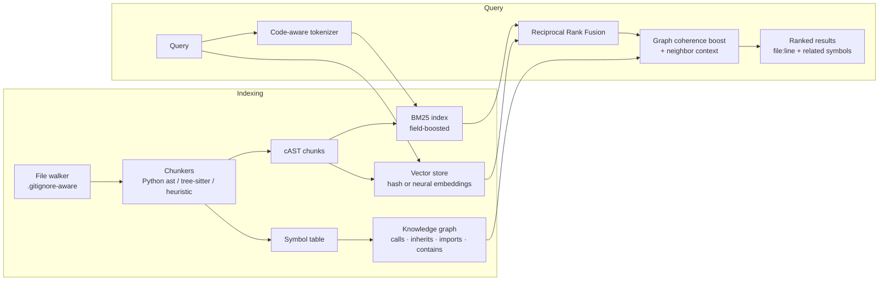

# CodeFabric

**A structure-aware RAG knowledge fabric for codebases** — hybrid retrieval
(BM25 + embeddings) fused with a code knowledge graph, exposed as a CLI,
a Python library, and an MCP server for AI agents.

CodeFabric is inspired by the symbol-level navigation of
[Serena](https://github.com/oraios/serena) but is an independent,
from-scratch implementation that goes further: where Serena relies on live
Language Server Protocol sessions for symbol lookups, CodeFabric builds a
**persistent, queryable knowledge fabric** over the repository — combining
lexical search, semantic search, and structural graph traversal in one
ranked answer.

## Why not just an LSP bridge?

| Capability | LSP-based tools (Serena) | CodeFabric |
|---|---|---|
| Symbol definitions / references | ✅ via language server | ✅ via persisted symbol table + graph |
| Natural-language search ("where do we verify passwords?") | ❌ | ✅ hybrid BM25 + dense retrieval with rank fusion |
| Structure-aware chunking for LLM context | ❌ (returns symbols only) | ✅ cAST-style AST chunking with class-context headers |
| Impact analysis ("what breaks if I change this?") | partial (references) | ✅ transitive BFS over call/inherit/import edges |
| Result context for prompts | file/line | ✅ each hit decorated with callers/callees/subclasses |
| Works offline / air-gapped | needs language servers installed | ✅ pure-stdlib core, zero dependencies |
| Incremental re-index | n/a (live) | ✅ content-hash based, only changed files re-parsed |

## Architecture



The index lives in `<repo>/.codefabric/` as plain JSON — transparent,
diffable, and consumable by other tools.

### Retrieval pipeline

1. **Code-aware tokenization** — identifiers are emitted both whole and as
   subwords (`getUserById` → `getuserbyid`, `get`, `user`, `id`), so
   natural-language queries match code.
2. **Sparse leg** — Okapi BM25 with field boosting (symbol names ×3,
   docstrings ×2, file path).
3. **Dense leg** — pluggable embeddings; the default is a deterministic
   feature-hashing embedder (offline, no downloads), upgradeable to any
   permissively-licensed sentence-transformers model.
4. **Reciprocal Rank Fusion** — rank-based fusion, no score calibration.
5. **Graph coherence boost** — hits whose graph neighbors also matched are
   promoted (a cluster of connected hits marks the right subsystem), and
   every result carries its callers/callees/subclasses for LLM context.

### Chunking

Follows the cAST principle (split-then-merge on AST boundaries):

- **Python** — stdlib `ast`: full-fidelity chunks, symbols, docstrings,
  call/inheritance/import extraction. Oversized classes split into method
  chunks that carry a `# context: class …` header.
- **13 more languages** (JS/TS, Java, Go, Rust, C/C++, C#, Ruby, Kotlin,
  PHP, Scala, Swift) — tree-sitter when the `ast` extra is installed,
  otherwise a declaration-regex + brace-balancing heuristic chunker.
- **Everything else** — blank-line-aware sliding windows.

## Install & use

```bash
pip install -e .              # zero runtime dependencies
pip install -e ".[ast]"       # + tree-sitter grammars (MIT)
pip install -e ".[ml]"        # + neural embeddings (Apache-2.0)
pip install -e ".[mcp]"       # + MCP server (MIT)
```

```bash
codefabric index /path/to/repo                  # build/update (incremental)
codefabric search "where do we hash passwords" --path /path/to/repo
codefabric symbol authenticate --path /repo     # definition lookup
codefabric callers load_user --path /repo       # who calls this?
codefabric impact hash_password --path /repo    # what breaks if it changes?
codefabric outline app/auth.py --path /repo     # file symbol map
codefabric mcp --path /repo                     # serve to AI agents
```

Neural embeddings (optional): `codefabric index --embedder st:BAAI/bge-small-en-v1.5`

### As a library

```python
from codefabric import Indexer, IndexConfig, SearchEngine

Indexer("/repo", IndexConfig()).build()
engine = SearchEngine("/repo")
for hit in engine.search("verify user credentials", k=5):
    print(hit.chunk.file_path, hit.chunk.start_line, hit.chunk.symbol, hit.score)
    print(hit.related)  # callers / callees / subclasses
```

### MCP tools exposed

`search_code`, `find_symbol`, `find_callers`, `impact_analysis`,
`file_outline`, `reindex`, `index_stats` — a superset of the retrieval
surface agents get from LSP bridges, usable from Claude Code or any MCP
client.

## Licensing posture

Everything in this repository is original code under **Apache-2.0**
(patent grant included — the enterprise-safe choice). Algorithms are
implemented from their published papers, not from other codebases:

| Component | Source of the idea | Our implementation |
|---|---|---|
| BM25 | Robertson & Zaragoza (public formula) | from scratch, stdlib |
| Reciprocal Rank Fusion | Cormack et al. 2009 (public formula) | from scratch, stdlib |
| cAST chunking | Zhang et al. 2025 (method paper) | from scratch, stdlib `ast` |
| Feature hashing | Weinberger et al. 2009 | from scratch, stdlib |

Optional dependencies are all permissive — no GPL/AGPL anywhere in the
tree: `tree-sitter` (MIT), `tree-sitter-language-pack` (MIT),
`sentence-transformers` (Apache-2.0), `numpy` (BSD), `mcp` (MIT).
Serena itself is MIT-licensed, but no Serena code was copied or ported.
If you enable neural embeddings, pick a model whose weights are
Apache/MIT-licensed (e.g. BGE family) — model licenses are separate from
code licenses.

## Testing

```bash
PYTHONPATH=src python3 -m unittest discover -s tests   # 34 tests, stdlib only
```

## Roadmap

- Cross-encoder reranking stage (optional `ml` extra)
- LanceDB / Qdrant vector-store adapters for multi-million-chunk repos
- Watch mode (filesystem events → incremental re-index)
- PageRank-style symbol centrality as a static rank prior
- Multi-repo federation (one fabric across many services)
